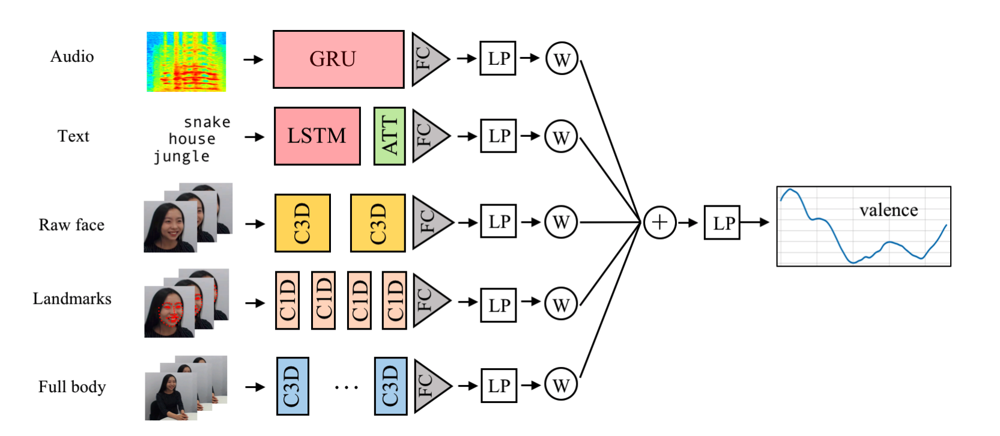

# OMG Empathy Challenge 2019

&nbsp;
&nbsp;
&nbsp;
&nbsp;
&nbsp;

This is an ensemble multimodal model developed for the [OMG Empathy Challenge 2019](https://www2.informatik.uni-hamburg.de/wtm/omgchallenges/omg_empathy2018_results2018.html#) by the **Alpha - City team** (collaboration of [Telefónica Innovation Alpha, Barcelona, Spain](https://www.alpha.company/), and [MIRG - City, University of London, UK](http://mirg.city.ac.uk/)).

This model integrates predictions from different sources (video, audio, and dialogue transcript). To run the full model, each individual module needs to be run separately and the prediction of each of them integrated using one of the proposed methods (Regression model, Smoothed weighted average model or K-nearest Neighbours Model).

The overall diagram of the model is the following:

